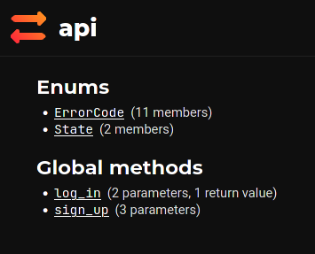
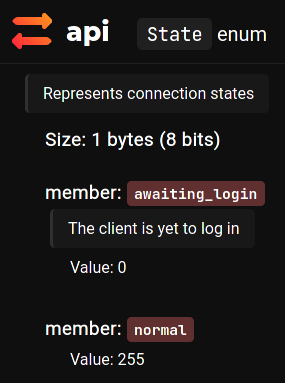
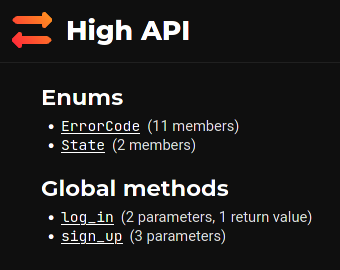
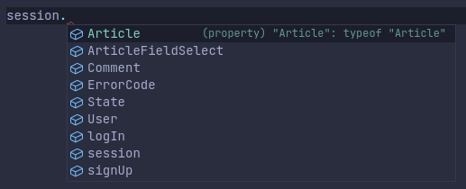

This is a tutorial on how to write an AMOGUS-based API client for an imaginary article publishing service with **TypeScript** and **Webpack**. Hopefully by the end of it you're going to be able to apply certain key concepts to your actual service.
> All `npm` commands in this tutorial are going to be invoked with `pnpm` - a drop-in replacement that doesn't waste disk space. I recommend that you use it too, but you don't have to.

## Step 1. Creating a project and downloading the necessary tools
```console
$ pip3 install -U susc
$ mkdir amogus-tutorial
$ cd amogus-tutorial
$ pnpm init -y
$ pnpm i amogus-driver
$ pnpm i -D webpack webpack-cli sus-loader
$ mkdir src
$ touch src/index.ts
$ touch src/api.sus
$ git init
$ echo "node_modules" > .gitignore
$ echo "*.sus.ts" >> .gitignore
```
You can also install the **SusLang** extension for VSCode for syntax highlighting.

## Step 2. Setting end goals
First of all, let's set some goals for our service:
  - Users should be able to **create accounts and log in**
  - **No access tokens** are going to be involved for simplicity sake
  - Users should be able to **publish articles**
  - Users should be able to **like and comment on each others' articles, as well as like those comments**

Simple, right?

## Step 3. Writing SUS
SUS is a special language that lets you describe your API: what methods there are, what objects can the server and the client send to each other, and so on.
> A special common language is desired when your frontends and the backend are written in different languages, which they probably are.

### Standard library
Include it with:
```sus
# <-- by the way, comments start with a hash
include impostor.sus
```

### Account creation
The "create account" operation should take three parameters (email, username and password) and return either nothing or an error. This operation is not exactly attached to anything, and in SUS it is best described with something called a **global method**. Take a look:
```sus
globalmethod sign_up(0) {
    email: Str;
    username: Str;
    password: Str;
}
```
Whoa, hold on! What does that `0` there mean? It's the **method value** - a special number that distinguishes this method from others. Why can't AMOGUS use its name? Because it's a protocol that's aimed at maximum encoding efficiency - it's cheaper to send one number over the wire than a string. This number can range between `0` and `127`, thus giving you a maximum of `128` global methods. You can't have two methods with matching names, and you can't have ones with matching values either.

We're not quite pushing AMOGUS to its limits yet. Let's say that you want to make sure that whatever your clients send you in the `email` field is an email address before you even try to send the confirmation email or whatever - quite a sensible requirement. You can use **validators** to perform this task. Take a look:
```sus
globalmethod sign_up(0) {
    email: Str[match: /[^ @]@[^ @]/]; # please don't use this regex in production
    username: Str[match: /\w*/, len: 3..32];
    password: Str[len: 6..64];
}
```
`match: /[^ @]@[^ @]/` in square brackets is a validator, and so is `len: 3..32`. Every type has its own set of validators. `Str` has two: `match` that takes a **regular expression** (three flags are supported: `i`, `m` and `s`) and `len` that takes a **range** (can be written in one of two ways: `start..end`, both ends inclusive, and `start+` that goes up to infinity).

We said that `sign_up` may also return an error if something goes wrong. How do we describe that?
```sus
enum(2) ErrorCode {
    email_in_use(0),
    username_taken(1)
}

globalmethod sign_up(0) {
    email: Str[match: /[^ @]@[^ @]/];
    username: Str[match: /\w*/, len: 3..32];
    password: Str[len: 6..64];

    errors { email_in_use, username_taken }
}
```
That `ErrorCode` **enum** describes all possible errors that all of the methods may return. That `2` means that the members are encoded using a 2-byte (16-bit) number, giving you a maximum of `65536` members. Each member also has a **value** associated with it - just like in the case of methods, it's used to identify them when sent over the wire. The `errors` declaration describes which of the errors this specific method may return. **Note**: the server also sends a human-readable error message along with this machine-readable code. What exactly is sent in that message is entirely up to you and is specified by the server code. **Note**: If any of the validations fail, the server-side AMOGUS library will automatically return a `validation_failed` error before any data even reaches your code.

### Logging in
Great! Now that the user has an account, they can log in. Just kidding! They can't, because we haven't yet written a method for that.
```sus
enum(2) ErrorCode {
    email_in_use(0),
    username_taken(1),
    invalid_email(2),
    invalid_password(3)
}

globalmethod log_in(1) {
    email: Str[match: /[^ @]@[^ @]/];
    password: Str[len: 6..64];

    returns {
        username: Str[match: /\w*/, len: 3..32];
    }

    ratelimit 5 every 60s;
    errors { invalid_email, invalid_password }
}
```
Now we have. Two new directives: `returns`, which specifies the return fields and `ratelimit` which specifies the rate limit. The time interval can be anything - from `[number]ms` to `[number]y`: `ms`, `s`, `m`, `h`, `d`, `mo`, `y`.

How do you prevent someone from logging in twice? How do you make sure that once a user has logged in, they can't log in a second time? Or that they can't create another account while they're logged in? States! Take a look:
```
enum(1) State {
    awaiting_login(0)
}
set default_state awaiting_login

globalmethod sign_up(0) {
    # ... all the stuff we've already written
    states { awaiting_login }
}

globalmethod log_in(1) {
    # ... all the stuff we've already written
    states { awaiting_login }
}
```
This `states` directive tells us that this method can only be called while the session is in the `awaiting_login` state. There's a second state defined by `impostor.sus`: `normal`. Your server code will have to switch the state from `awaiting_login` to `normal` once authentication succeeds. The `set default_state` directive tells us to start in the `awaiting_login` state - without that it'd start in `normal`.

Let's sprinkle in some docstrings! They're different from comments: comments are completely ignored, whereas docstrings are emitted in the output, and are especially useful in combination with the `html` output module. **They** _support_ **_markdown_**!
```
include impostor.sus

enum(2) ErrorCode {
    @> Email supplied to `sign_up()` is already in use <@
    email_in_use(0),
    @> Username supplied to `sign_up()` has already been taken <@
    username_taken(1),
    @> Email supplied to `log_in()` is not associated with an account <@
    invalid_email(2),
    @> Password supplied to `log_in()` is invalid <@
    invalid_password(3)
}

enum(1) State {
    @> The client is yet to log in <@
    awaiting_login(0)
}
set default_state awaiting_login

@> Creates a user account <@
globalmethod sign_up(0) {
    @> User's email address <@
    email: Str[match: /[^ @]@[^ @]/]; # please don't use this regex in production
    @> Desired username <@
    username: Str[match: /\w*/, len: 3..32];
    @> Desired password <@
    password: Str[len: 6..64];

    states { awaiting_login }
    errors { email_in_use, username_taken }
}

@> Logs in to an account for the rest of this session <@
globalmethod log_in(1) {
    @> User's email <@
    email: Str[match: /[^ @]@[^ @]/];
    @> User's password <@
    password: Str[len: 6..64];

    returns {
        @> Username associated with that email <@
        username: Str[match: /\w*/, len: 3..32];
    }

    ratelimit 3 every 60s;
    states { awaiting_login }
    errors { invalid_email, invalid_password }
}
```

### Generating docs
Our API is quite far from done, but let's just see how the built-in doc generator works. Run this command:
```console
$ susc -l html src/api.sus
```
This command should create an `api_output` folder right next to the original file with an `html` directory inside it. Open `index.html` in a browser!



This is `State`:



Here's our `awaiting_login`. Where is that `normal` coming from though? Let's look inside the standard library that we included (`impostor.sus`)
```sus
@> Represents connection states <@
enum(1) State {
    normal(255)
}
```
Even though this `State` enum has been defined two times in two separate files, susc combined these definitions into one enum! In other words,
```sus
enum(1) Name {
    member_one(0)
}
enum(1) Name {
    member_two(1)
}
```
...is equivalent to the following:
```sus
enum(1) Name {
    member_one(0),
    member_two(1)
}
```
...even if the definition is split across multiple files, as long as these files are `include`d.

There's also somehow 11 whole members in the `ErrorCode` enum, even though we only defined 4 - the mechanism is the same.

Lastly, you may have noticed these messages from the compiler:


We don't yet have a logo for our service, nor do we have a name. I'm going to name it "High", because (as you could probably already tell) i'm not good at coming up with sensible names, and this imaginary project is not at all similar in concept to Medium. Let's put `set html_topbar_title High API` at the top of our file and run that command again:



Excellent!

### Articles
We could just use a massive amount of global methods, but we will employ a much more powerful mechanism: **entities**. An entity is like a class in OOP languages: it has a set of fields, static and dynamic methods, and is thus best suited for logical objects in your API. We're going to have three entities: `User`, `Article` and `Comment`. Let's start with the second one:
```
entity Article(1) {
    id: Int(8);
    title: Str[len: 5..80];
    contents: opt(0) Str;
}
```
  - Every entity must have an `id` of type `Int(8)`. The value of this field distinguishes particular instances of this entity, and the server must ensure that there's only 0 or 1 entity instances with a given **id**.
  - The `Int(8)` type is an 8-byte (64-bit) nonnegative (0 or more) integer. Notice that the `8` is inside parentheses instead of square brackets because it's an **argument** to this type, not a validator. `Str`s do not require any arguments, so that's why we omitted the parentheses before. `Int`s can be validated too, by testing whether or not the value is in a range like this: `Int(1)[val: 30..40]`.
  - This `opt(0)` means that the field is **optional**. Why would such an important field be optional? Because we may get an article in two different contexts: first, in response to a "I know the id, give me the article" request, and second, in response to a "give me the list of all articles that user [id] has published". It's more efficient to skip sending the contents in the latter case because we don't need them anyway. AMOGUS uses the number `0` to distinguish this particular optional field from other ones. It can range from `0` to `127`, giving you a maximum of `128` optional fields per entity type. The number of normal (required) fields is unlimited. **Note**: Method parameters/return values can be marked as optional as well.
  - Notice that we don't restrict `contents` by length simply because the `Str` type itself limits the length: it can't exceed 65536 bytes because of the way data is encoded. **Note**: Bytes does not equal characters! A Latin character may only take up one byte; Cyrillic ones usually take up two; Chinese and Japanese symbols tend to span 3-4 bytes; and emojis can take up significantly more space - from 3-4 bytes for simple ones to something like 🤦🏼‍♂️ that [actually spans 5 codepoints and takes up 17 whole bytes](https://hsivonen.fi/string-length/)! Don't worry: 64 KB is plenty of data - this tutorial up to this point (excluding the images) is around 11.5 KB. **Note**: The `Str[len]` validator validates length based on the number of Unicode codepoints, not the number of bytes. That emoji from before is thus going to be counted as 5 characters by `Str[len]`.

### Publishing articles
We're going to create a **static method** in the `Article` entity. It's called a _static_ method because it's not attached to a particular instance of an entity, but it is attached to the entity type. _Global_ methods like the ones we created earlier are attached to neither.
```sus
entity Article(1) {
    id: Int(8);
    title: Str[len: 5..140];
    contents: opt(0) Str;

    staticmethod create(0) {
        title: Str[len: 5..140];
        contents: Str;

        returns {
            id: Int(8);
        }

        ratelimit 1 every 1m;
        states { normal }
    }
}
```
Value `127` is reserved for the "get entity by ID" operation, thus you can have up to `127` static methods per entity.

### Liking articles
We're going to add a like counter and a method to like an article. Because this `like` method is attached to a particular article, we're going to make it a **dynamic method**
```sus
entity Article(1) {
    # ...
    likes: Int(3); # allows us to count up to ~16.7M likes
    # ...
    method like(0) {
        ratelimit 2 every 10s; # this rate limit applies to calls to `Article.like()` across all `Article` instances
        states { normal }
    }
}
```
You can have up to `128` dynamic methods per entity. Notice that `create(0)` and `like(0)` are not in conflict because static methods are separate from dynamic ones.

### User entities
Now that we know what entities are, we can create a `User` entity and update our `log_in` method so that it returns a reference to the user account that your backend has hopefully created when we called `sign_up`
```sus
entity User(0) {
    id: Int(8);
    name: Str[match: /\w*/, len: 3..32];
    avatar: Str[match: /https?:\/\/.*\.(webp|png|jpe?g)/, len: 0..128];

    method report(0) {
        reason: Str[len: 10+];
        ratelimit 1 every 1m;
        states { normal }
    }

    method get_articles(1) {
        returns {
            articles: List(Int(8), 1);
        }
        ratelimit 1 every 1s;
        states { normal }
    }
}

globalmethod log_in(1) {
    # ... 
    returns {
        @> User account associated with that email <@
        user: Int(8);
    }
    # ...
}
```
New type! `List` takes two arguments: the type of the elements and the header length. It's set to `1` byte or 8 bits, so this list can't have more than `255` elements. `List`s can be validated by their length, e.g. `List(Int(1), 1)[len: 10..20]`. Values inside the list can be validated too! `List(Int(1)[val: 30..40], 1)[len: 10..20]` is a valid expression.

### Comments
No new concepts here, we're just defining two `Article` methods and the `Comment` entity.
```sus
entity Article(1) {
    # ...
    method get_comments(1) {
        returns {
            comments: List(Int(8), 2);
        }
        ratelimit 1 every 1s;
        states { normal }
    }

    method post_comment(2) {
        text: Str[len: 1..280];
        ratelimit 2 every 10s;
        states { normal }
    }
}

entity Comment(2) {
    id: Int(8);
    author: Int(8);
    text: Str[len: 1..280];

    method like(0) {
        ratelimit 2 every 10s;
        states { normal }
    }
}
```

### Done!
Woohoo! We've successfully written our first SUS file. Now run
```console
$ susc -l html src/api.sus
```
again and browse the final docs.


**Note**: This `ArticleFieldSelect` bitfield was generated automatically.

We have learned about almost anything there is to AMOGUS. The two things that we haven't talked about yet are **bitfields** and **confirmations**, the latter being an extremely powerful mechanism that we're going to explore later.

## Developing the client
First of all, launch the compiler in watch mode in the background so that it provides TS declarations for the SUS file.
```console
$ susc --gen-ts src/api.sus
OR
$ susc -t src/api.sus
```
Put this in `index.ts`:
```ts
// import the libraries
import { TlsClient } from "amogus-driver/transport/node";
// load our protocol definition
import * as api from "./api.sus";

// create the session
const session = api.$bind(new TlsClient(api.$specSpace, {
    host: "my.awesomeservice.com",
    port: 1234
}));
```
If everything is working properly, IntelliSense should suggest all the things we've defined when you type `session.`:



Try this:
```ts
await session.logIn({
    email: "test@email.com",
    password: 123
});
```
Because we defined `password` to be a string and because TypeScript is awesome, the code above does not compile:


If we correct the password to be a string, say `"123456"`, the error disappears.

**Note**: Only the type is validated at compile time. Validators in square brackets run at run time. Even though we've specified a regex for our `email` field, TypeScript won't complain if we assign `"not.an.email"` to it.

Static methods do not need an entity instance, and are called like this:
```ts
const contents = `
# Welcome!
This is my first article on this service. Hope you're having a **wonderful** time!
`;
const { id } = await session.Article.create({
    title: "My First Article On High",
    contents: contents
});
```

Dynamic methods, however, do, and they're called like this:
```ts
const article = await session.Article.$get(id); // `$get` is a standard wrapper for `get`
await article.postComment({
    text: "I spent a lot of time working on this article! Please like if you choose to"
});
```

# Rapid testing
Consider the following SUS:
```sus
include impostor.sus

globalmethod echo(0) {
    str: Str;
    returns {
        str: Str;
    }
    confirmations { Captcha }
}

confirmation Captcha(0) {
    request {
        url: Str;
    }
    response {
        code: Str;
    }
}
```

You don't have to set up a server/client pair that communicates over some legitimate protocol like TCP. Instead, you can use the `createDummyPair` function that creates a server and a client that exchange data by passing `Buffer`s to each other. It's aimed primarily towards testing.

```ts
import * as amogus from "amogus-driver";
import * as api from "./test.sus";

type ApiType = ReturnType<typeof api.$specSpace>;
const { client, server } = amogus.transport.universal.createDummyPair<ApiType>(api.$specSpace);

// SERVER SIDE
// the second argument is the state, we'll just ignore it for now
const serverSession = new amogus.Server(server, null);
const serverApi = api.$bind(server);
serverSession.onInvocation("echo", async (method, _state) => {
    // ask the client to solve a captcha
    const { code } = await event.confirm(new api.Captcha(), { url: "https://example.com/amogus.png" });

    // check captcha solution
    if(code === "amogus")
        await event.return({ str: `${event.params.str} (hi from the server)` });
    else
        await event.error(serverApi.ErrorCode.confirmation_failed, "captcha blah blah blah");
});


// CLIENT SIDE
const session = api.$bind(client);
// invoke echo()
const { str } = await session.echo({ str: "Hello, World!" }, async (conf) => {
    // reply with "amogus" to captcha requests
    if(conf instanceof api.Captcha) {
        console.log("captcha requested:", conf.request.url);
        return { code: "amogus" };
    }
});
console.log("got response:", str);
```
